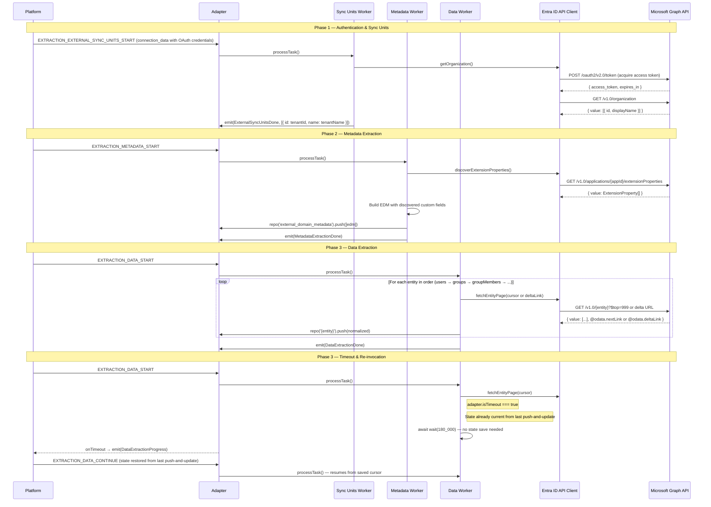
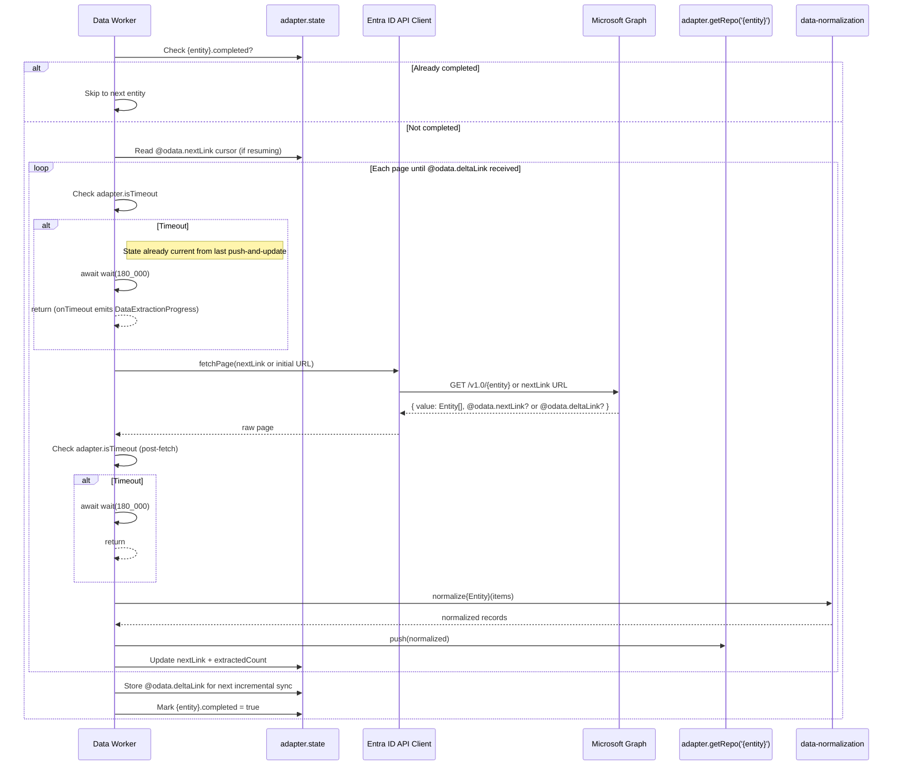
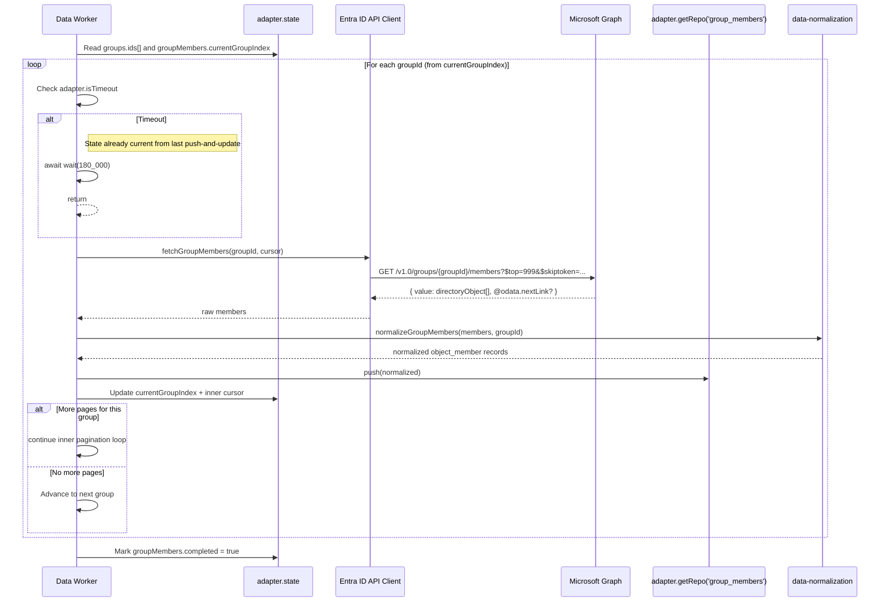
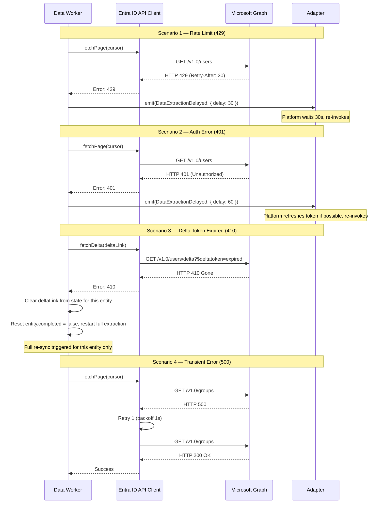

# Technical Design Document: Azure Entra ID

> **Version**: 1.0
> **Last Updated**: 2026-03-11
> **Connector Directory**: `airdrop-azure-entra-id-snap-in/`
> **Status**: Draft

---

## Table of Contents

1. [Overview](#1-overview)
2. [Phase 1: Authentication & Configuration](#2-phase-1-authentication--configuration)
3. [Phase 2: Entity Model & Domain Mapping](#3-phase-2-entity-model--domain-mapping)
4. [Phase 3: Data Extraction Flow](#4-phase-3-data-extraction-flow)
5. [Phase 4: Error Handling & Resilience](#5-phase-4-error-handling--resilience)
6. [Appendix](#6-appendix)

---

## 1. Overview

### 1.1 External System

| Property | Value |
|----------|-------|
| System Name | Azure Entra ID (Microsoft Entra ID) |
| API Base URL | `https://graph.microsoft.com/v1.0/` |
| API Type(s) Used | Microsoft Graph REST API (OData v4) |
| API Version | v1.0 (stable) |
| API Documentation | https://learn.microsoft.com/en-us/graph/overview |
| Rate Limits | HTTP 429 with `Retry-After` header; throttling per tenant and per app |

### 1.2 Sync Summary

| Property | Value |
|----------|-------|
| Sync Direction | Forward only (Azure Entra ID → DevRev) |
| Auth Method | OAuth 2.0 Client Credentials — keyring: `azure-entra-oauth` |
| Entities Extracted | Users, Groups, Group Members, Directory Roles, Role Members, Applications, Service Principals, Devices, Org Contacts, Extension Properties |
| Incremental Sync Support | Yes — Microsoft Graph Delta Queries (`/delta` endpoint, 7-day token lifetime) |
| Attachment Support | No |
| Custom Fields Support | Yes — directory extension attributes on Users (maps to `devu`, which supports custom fields) |

---

## 2. Phase 1: Authentication & Configuration

### 2.1 Authentication

| Property | Value |
|----------|-------|
| Keyring Type | `azure-entra-oauth` |
| Kind | `Secret` (stores `tenant_id`, `client_id`, `client_secret`) |
| Token Acquisition | Connector calls `POST https://login.microsoftonline.com/{tenantId}/oauth2/v2.0/token` with `client_credentials` grant |
| Token Extraction Pattern | `adapter.event.payload.connection_data.key` (access token after OAuth exchange) |
| Auth Header Format | `Authorization: Bearer <access_token>` |
| Token Scope | `https://graph.microsoft.com/.default` |

**Required OAuth scopes (application permissions):**

| Permission | Entities |
|---|---|
| `User.Read.All` | Users |
| `GroupMember.Read.All` | Groups, Group Members |
| `RoleManagement.Read.Directory` | Directory Roles, Role Members |
| `Application.Read.All` | Applications, Service Principals |
| `Device.Read.All` | Devices |
| `OrgContact.Read.All` | Org Contacts |

### 2.2 Organization Data (Manifest)

> Defines how the platform identifies the external organization. Used in `manifest.yaml` under `organization_data`.

| Property | Value |
|----------|-------|
| Source | `config` |
| URL | `https://graph.microsoft.com/v1.0/organization` |
| Method | `GET` |
| Headers | `Authorization: Bearer [ACCESS_TOKEN]` |
| Response JQ | `.value[0] \| {id: .id, name: .displayName}` |

**Why this endpoint?**: Returns the authenticated tenant's organization record, which uniquely identifies the Entra ID tenant. The `id` field is the tenant GUID and serves as the unique external organization identifier.

> **If `is_subdomain` is NOT used**, `organization_data` is **required** in the manifest. This tells the platform how to uniquely identify the external organization for the connection.

### 2.3 External Sync Unit

> The sync unit defines the scope boundary for extraction. Typically the organization/tenant/workspace.

| Property | Value |
|----------|-------|
| Sync Unit Source | `adapter.event.payload.connection_data.org_id` |
| Sync Unit Meaning | "Azure Entra ID tenant" |
| Multiple Sync Units? | No — single tenant per connection |

**Discovery mechanism**: The tenant ID from `connection_data.org_id` is used as a single sync unit. There is one sync unit per connection representing the entire Entra ID tenant.

---

## 3. Phase 2: Entity Model & Domain Mapping

### 3.1 Entity Catalog

> Classify each entity per `docs/rules/connector-entity-classification.md`.

| # | External Entity | Classification | API Endpoint | DevRev Target Type | Extraction Strategy | Parent Entity | Incremental Support |
|---|----------------|---------------|-------------|-------------------|-------------------|---------------|-------------------|
| 1 | Users | **Mandatory** | `GET /v1.0/users` | `devu` | Paginated list | None | Yes — delta query |
| 2 | Groups | **Mandatory** | `GET /v1.0/groups` | `group` | Paginated list | None | Yes — delta query |
| 3 | Group Members | **Child** (of Groups) | `GET /v1.0/groups/{id}/members` | `object_member` | Nested under Groups | Groups | No — re-extract per group delta |
| 4 | Directory Roles | **Mandatory** | `GET /v1.0/directoryRoles` | `group` | Paginated list | None | Yes — delta query |
| 5 | Role Members | **Child** (of Directory Roles) | `GET /v1.0/directoryRoles/{id}/members` | `object_member` | Nested under Roles | Directory Roles | No — re-extract per role delta |
| 6 | Applications | **Optional** (user-selected) | `GET /v1.0/applications` | `fresh_custom` | Paginated list | None | Yes — delta query |
| 7 | Service Principals | **Optional** (user-selected) | `GET /v1.0/servicePrincipals` | `fresh_custom` | Paginated list | None | Yes — delta query |
| 8 | Devices | **Optional** (user-selected) | `GET /v1.0/devices` | `fresh_custom` | Paginated list | None | Yes — delta query |
| 9 | Org Contacts | **Optional** (user-selected) | `GET /v1.0/contacts` | `revu` | Paginated list | None | Yes — delta query (`orgContact/delta`) |
| 10 | Extension Properties | **Custom fields** | `GET /v1.0/applications/{id}/extensionProperties` | Custom fields on `devu` | Discovery at sync start | None | No — re-discover each full sync |

### 3.1a API Endpoint Verification Table (MANDATORY)

> Every endpoint verified against Microsoft Graph official documentation before code generation.

| Entity | Operation | Verified URL Path | HTTP Method | Response Format | Pagination | Source |
|--------|-----------|-------------------|-------------|-----------------|------------|--------|
| Users | List all | `GET /v1.0/users` | GET | Named wrapper `{ value: User[] }` + `@odata.nextLink` | `@odata.nextLink` cursor | https://learn.microsoft.com/en-us/graph/api/user-list |
| Users | Delta (incremental) | `GET /v1.0/users/delta` | GET | Named wrapper `{ value: User[] }` + `@odata.deltaLink` | `@odata.nextLink` → `@odata.deltaLink` | https://learn.microsoft.com/en-us/graph/delta-query-overview |
| Groups | List all | `GET /v1.0/groups` | GET | Named wrapper `{ value: Group[] }` + `@odata.nextLink` | `@odata.nextLink` cursor | https://learn.microsoft.com/en-us/graph/api/group-list |
| Groups | Delta (incremental) | `GET /v1.0/groups/delta` | GET | Named wrapper `{ value: Group[] }` + `@odata.deltaLink` | `@odata.nextLink` → `@odata.deltaLink` | https://learn.microsoft.com/en-us/graph/delta-query-overview |
| Group Members | List by group | `GET /v1.0/groups/{id}/members` | GET | Named wrapper `{ value: directoryObject[] }` | `@odata.nextLink` (max 999) | https://learn.microsoft.com/en-us/graph/api/group-list-members |
| Directory Roles | List all | `GET /v1.0/directoryRoles` | GET | Named wrapper `{ value: DirectoryRole[] }` | `@odata.nextLink` | https://learn.microsoft.com/en-us/graph/api/directoryrole-list |
| Directory Roles | Delta | `GET /v1.0/directoryRoles/delta` | GET | Named wrapper `{ value: DirectoryRole[] }` + `@odata.deltaLink` | `@odata.nextLink` → `@odata.deltaLink` | https://learn.microsoft.com/en-us/graph/delta-query-overview |
| Role Members | List by role | `GET /v1.0/directoryRoles/{id}/members` | GET | Named wrapper `{ value: directoryObject[] }` | `@odata.nextLink` | https://learn.microsoft.com/en-us/graph/api/directoryrole-list-members |
| Applications | List all | `GET /v1.0/applications` | GET | Named wrapper `{ value: Application[] }` + `@odata.nextLink` | `@odata.nextLink` (max 999) | https://learn.microsoft.com/en-us/graph/api/application-list |
| Applications | Delta | `GET /v1.0/applications/delta` | GET | Named wrapper `{ value: Application[] }` + `@odata.deltaLink` | `@odata.nextLink` → `@odata.deltaLink` | https://learn.microsoft.com/en-us/graph/delta-query-overview |
| Service Principals | List all | `GET /v1.0/servicePrincipals` | GET | Named wrapper `{ value: ServicePrincipal[] }` | `@odata.nextLink` | https://learn.microsoft.com/en-us/graph/api/serviceprincipal-list |
| Service Principals | Delta | `GET /v1.0/servicePrincipals/delta` | GET | Named wrapper `{ value: ServicePrincipal[] }` + `@odata.deltaLink` | `@odata.nextLink` → `@odata.deltaLink` | https://learn.microsoft.com/en-us/graph/delta-query-overview |
| Devices | List all | `GET /v1.0/devices` | GET | Named wrapper `{ value: Device[] }` | `@odata.nextLink` | https://learn.microsoft.com/en-us/graph/api/device-list |
| Devices | Delta | `GET /v1.0/devices/delta` | GET | Named wrapper `{ value: Device[] }` + `@odata.deltaLink` | `@odata.nextLink` → `@odata.deltaLink` | https://learn.microsoft.com/en-us/graph/delta-query-overview |
| Org Contacts | List all | `GET /v1.0/contacts` | GET | Named wrapper `{ value: OrgContact[] }` | `@odata.nextLink` | https://learn.microsoft.com/en-us/graph/api/orgcontact-list |
| Org Contacts | Delta | `GET /v1.0/contacts/delta` | GET | Named wrapper `{ value: OrgContact[] }` + `@odata.deltaLink` | `@odata.nextLink` → `@odata.deltaLink` | https://learn.microsoft.com/en-us/graph/delta-query-overview |
| Extension Properties | List by app | `GET /v1.0/applications/{id}/extensionProperties` | GET | Named wrapper `{ value: ExtensionProperty[] }` | Single page (no pagination) | https://learn.microsoft.com/en-us/graph/api/application-list-extensionproperty |
| Organization | Get tenant | `GET /v1.0/organization` | GET | Named wrapper `{ value: Organization[] }` | Single object | https://learn.microsoft.com/en-us/graph/api/organization-get |

**Response Format**: All Microsoft Graph list endpoints return `{ "@odata.context": "...", "value": [...], "@odata.nextLink": "..." }`. Data is always in the `value` array — never a flat array, never a different wrapper property name.

**Delta query lifecycle**:
1. Initial: `GET /v1.0/{resource}/delta` — returns pages with `@odata.nextLink`, final page has `@odata.deltaLink`
2. Store `@odata.deltaLink` in state
3. Incremental: Call stored `@odata.deltaLink` — returns only changes since last call
4. Deleted items appear with `"@removed": {"reason": "changed"|"deleted"}`
5. Token expiry: 7 days → HTTP 410 Gone or error `syncStateNotFound` → clear delta link and do full re-sync

### 3.2 Entity to DevRev Object Mapping (Initial Domain Mapping)

| External Entity (EDM key) | DevRev Object Type | Object Category | Required Fields (need fallback) | Notes |
|---------------------------|-------------------|-----------------|----------------------------------|-------|
| `users` | `devu` | `stock` | `display_name` ✔ | Internal users — employees and service accounts in the tenant |
| `groups` | `group` | `stock` | `name` ✔, `description` ✔ | Entra ID security and Microsoft 365 groups |
| `group_members` | `object_member` | `stock` | `object_id` ✔, `target_object_type` ✔ | User-to-group membership links |
| `directory_roles` | `group` | `stock` | `name` ✔, `description` ✔ | Admin roles (Global Admin, User Admin, etc.) as DevRev groups |
| `role_members` | `object_member` | `stock` | `object_id` ✔, `target_object_type` ✔ | User-to-role assignment links |
| `applications` | (fresh_custom) | `fresh_custom` | none | App registrations — semantic purpose does not match any stock type |
| `service_principals` | (fresh_custom) | `fresh_custom` | none | Enterprise app identities — no matching stock type |
| `devices` | (fresh_custom) | `fresh_custom` | none | Entra-joined devices — no DevRev stock device type |
| `org_contacts` | `revu` | `stock` | `display_name` ✔ | External contacts from Exchange/on-premises AD |

### 3.3 Field Mappings Per Entity

#### Entity: `users` → DevRev `devu`

| External Field (EDM) | EDM Type | DevRev Stock Field | Transformation Method | Fallback Value | Notes |
|----------------------|----------|-------------------|----------------------|----------------|-------|
| `display_name` | `text` | `display_name` | `use_directly` | `"Unknown User"` | Required — fallback needed |
| `mail` | `text` | `email` | `use_directly` | — | Not required — NO fallback |
| `full_name` | `text` | `full_name` | `use_directly` | — | Constructed from givenName + surname in normalization |

> **Note**: `item_url_field`, `created_by_id`, `modified_by_id`, `tags` do NOT exist on `devu`. Do NOT include them.
> **Extension attributes**: Custom directory extension properties are surfaced as custom fields via the dynamic metadata skill.

#### Entity: `groups` → DevRev `group`

| External Field (EDM) | EDM Type | DevRev Stock Field | Transformation Method | Fallback Value | Notes |
|----------------------|----------|-------------------|----------------------|----------------|-------|
| `name` | `text` | `name` | `use_directly` | `"Unknown Group"` | Required — fallback needed |
| `description` | `text` | `description` | `use_rich_text` | `"No description"` | Required — fallback needed (rich_text type) |
| — | — | `type` | `use_fixed_value` | — | Fixed enum value `"static"` — all Entra groups are static type in DevRev |
| `item_url_field` | `text` | `item_url_field` | `use_directly` | — | Group URL in Entra admin portal |

#### Entity: `group_members` → DevRev `object_member`

| External Field (EDM) | EDM Type | DevRev Stock Field | Transformation Method | Fallback Value | Notes |
|----------------------|----------|-------------------|----------------------|----------------|-------|
| `member_id` | `reference` | `member_id` | `use_directly` | — | References `users` EDM entity |
| `group_id` | `reference` | `object_id` | `use_directly` | — | Required — references `groups` EDM entity |
| — | — | `target_object_type` | `use_fixed_value` | — | Fixed enum value `"group"` |
| — | — | `valid_from_date` | `use_raw_jq` | — | `now \| todate` (membership start = sync time) |

#### Entity: `directory_roles` → DevRev `group`

| External Field (EDM) | EDM Type | DevRev Stock Field | Transformation Method | Fallback Value | Notes |
|----------------------|----------|-------------------|----------------------|----------------|-------|
| `name` | `text` | `name` | `use_directly` | `"Unknown Role"` | Required — fallback needed |
| `description` | `text` | `description` | `use_rich_text` | `"No description"` | Required — fallback needed (rich_text type) |
| — | — | `type` | `use_fixed_value` | — | Fixed enum value `"static"` |
| `item_url_field` | `text` | `item_url_field` | `use_directly` | — | Role URL in Entra admin portal |

#### Entity: `role_members` → DevRev `object_member`

| External Field (EDM) | EDM Type | DevRev Stock Field | Transformation Method | Fallback Value | Notes |
|----------------------|----------|-------------------|----------------------|----------------|-------|
| `member_id` | `reference` | `member_id` | `use_directly` | — | References `users` EDM entity |
| `role_id` | `reference` | `object_id` | `use_directly` | — | Required — references `directory_roles` EDM entity |
| — | — | `target_object_type` | `use_fixed_value` | — | Fixed enum value `"group"` |
| — | — | `valid_from_date` | `use_raw_jq` | — | `now \| todate` |

#### Entity: `applications` → DevRev `fresh_custom`

| External Field (EDM) | EDM Type | DevRev Stock Field | Transformation Method | Notes |
|----------------------|----------|-------------------|----------------------|-------|
| `display_name` | `text` | `title` | `use_directly` | App registration display name |
| `app_id` | `text` | — | custom field | Application (client) ID |
| `sign_in_audience` | `enum` | — | custom field | Who can sign in (AzureADMyOrg, etc.) |
| `created_date_time` | `text` | — | custom field | App registration creation date |
| `item_url_field` | `text` | `item_url_field` | `use_directly` | Link to app in Entra portal |

#### Entity: `service_principals` → DevRev `fresh_custom`

| External Field (EDM) | EDM Type | DevRev Stock Field | Transformation Method | Notes |
|----------------------|----------|-------------------|----------------------|-------|
| `display_name` | `text` | `title` | `use_directly` | Service principal display name |
| `app_id` | `text` | — | custom field | Associated application ID |
| `service_principal_type` | `enum` | — | custom field | Application, ManagedIdentity, Legacy |
| `account_enabled` | `bool` | — | custom field | Whether SP is enabled |
| `item_url_field` | `text` | `item_url_field` | `use_directly` | Link to enterprise app in portal |

#### Entity: `devices` → DevRev `fresh_custom`

| External Field (EDM) | EDM Type | DevRev Stock Field | Transformation Method | Notes |
|----------------------|----------|-------------------|----------------------|-------|
| `display_name` | `text` | `title` | `use_directly` | Device display name |
| `operating_system` | `text` | — | custom field | Windows, iOS, Android, macOS, etc. |
| `operating_system_version` | `text` | — | custom field | OS version string |
| `trust_type` | `enum` | — | custom field | AzureAD, Workplace, ServerAD |
| `is_compliant` | `bool` | — | custom field | MDM compliance status |
| `is_managed` | `bool` | — | custom field | MDM managed status |

#### Entity: `org_contacts` → DevRev `revu`

| External Field (EDM) | EDM Type | DevRev Stock Field | Transformation Method | Fallback Value | Notes |
|----------------------|----------|-------------------|----------------------|----------------|-------|
| `display_name` | `text` | `display_name` | `use_directly` | `"Unknown Contact"` | Required — fallback needed |
| `mail` | `text` | `email` | `use_directly` | — | Not required |
| `full_name` | `text` | `full_name` | `use_directly` | — | Constructed from givenName + surname |
| `item_url_field` | `text` | `item_url_field` | `use_directly` | — | Contact URL in Entra |

### 3.4 Special Mapping Patterns Used

- [x] **`use_fixed_value`** — Used for: `group.type = 'static'` (on both `groups` and `directory_roles`); `object_member.target_object_type = 'group'` (on both `group_members` and `role_members`)
- [x] **`use_raw_jq`** — Used for: `object_member.valid_from_date = 'now | todate'` on `group_members` and `role_members`
- [x] **`use_rich_text`** — Used for: `group.description` and `directory_roles.description`
- [x] **`fresh_custom`** — Used for: `applications`, `service_principals`, `devices` (no matching stock DevRev type)

---

## 4. Phase 3: Data Extraction Flow

### 4.1 Extraction Order

```
1. Users (independent — mandatory)
2. Groups (independent — mandatory, collects group IDs for step 3)
3. Group Members (depends on Groups — iterates group IDs from step 2)
4. Directory Roles (independent — mandatory, collects role IDs for step 5)
5. Role Members (depends on Directory Roles — iterates role IDs from step 4)
6. Applications (independent — optional)
7. Service Principals (independent — optional)
8. Devices (independent — optional)
9. Org Contacts (independent — optional)
```

Extension properties are discovered at the start of full sync (before step 1) by listing apps that have registered extension properties. Results inform the dynamic metadata pushed in Phase 2 (metadata extraction).

### 4.2 Extraction Flowchart

```mermaid
flowchart TD
    START["processTask() starts\ndata-extraction.ts"] --> INIT["Initialize API client\nadapter.initializeRepos()"]
    INIT --> CHECK_USERS{"users\ncompleted?"}

    %% Users (paginated with delta)
    CHECK_USERS -- "Yes" --> CHECK_GROUPS
    CHECK_USERS -- "No" --> USERS_LOOP["extractUsers()"]
    USERS_LOOP --> USERS_TIMEOUT{"adapter.isTimeout?"}
    USERS_TIMEOUT -- "Yes" --> WAIT_TIMEOUT["await wait(180_000)\nno state save needed"]
    WAIT_TIMEOUT --> RETURN_TIMEOUT["return\n(onTimeout emits DataExtractionProgress)"]
    USERS_TIMEOUT -- "No" --> USERS_FETCH["Fetch page: GET /v1.0/users\nor delta URL from state"]
    USERS_FETCH --> USERS_TIMEOUT2{"adapter.isTimeout?\n(post-fetch)"}
    USERS_TIMEOUT2 -- "Yes" --> WAIT_TIMEOUT
    USERS_TIMEOUT2 -- "No" --> USERS_PUSH["adapter.getRepo('users')?.push(normalized)\n← pushAndUpdate saves state"]
    USERS_PUSH --> USERS_NEXT{"@odata.nextLink\npresent?"}
    USERS_NEXT -- "Yes" --> USERS_TIMEOUT
    USERS_NEXT -- "No" --> USERS_DONE["Store @odata.deltaLink\nMark users.completed = true"]
    USERS_DONE --> CHECK_GROUPS

    %% Groups (paginated, collect IDs)
    CHECK_GROUPS{"groups\ncompleted?"} -- "Yes" --> CHECK_GROUP_MEMBERS
    CHECK_GROUPS -- "No" --> GROUPS_LOOP["extractGroups()\ncollects group IDs in state"]
    GROUPS_LOOP --> GROUPS_PAGES["Same pagination loop as Users\npush() after each page\nstate.groups.ids.push(...newIds)"]
    GROUPS_PAGES --> CHECK_GROUP_MEMBERS

    %% Group Members (nested — iterate group IDs)
    CHECK_GROUP_MEMBERS{"groupMembers\ncompleted?"} -- "Yes" --> CHECK_ROLES
    CHECK_GROUP_MEMBERS -- "No" --> GM_LOOP["extractGroupMembers()\niterates state.groups.ids"]
    GM_LOOP --> GM_PARENT["For each groupId starting at state.groupMembers.currentGroupIndex"]
    GM_PARENT --> GM_TIMEOUT{"adapter.isTimeout?"}
    GM_TIMEOUT -- "Yes" --> WAIT_TIMEOUT
    GM_TIMEOUT -- "No" --> GM_FETCH["GET /v1.0/groups/{groupId}/members\nwith cursor if resuming"]
    GM_FETCH --> GM_PUSH["adapter.getRepo('group_members')?.push(normalized)\n← pushAndUpdate saves currentGroupIndex + cursor"]
    GM_PUSH --> GM_INNER{"More pages\nfor this group?"}
    GM_INNER -- "Yes" --> GM_TIMEOUT
    GM_INNER -- "No" --> GM_NEXT{"More groups?"}
    GM_NEXT -- "Yes" --> GM_PARENT
    GM_NEXT -- "No" --> GM_DONE["Mark groupMembers.completed = true"]
    GM_DONE --> CHECK_ROLES

    %% Directory Roles
    CHECK_ROLES{"directoryRoles\ncompleted?"} -- "Yes" --> CHECK_ROLE_MEMBERS
    CHECK_ROLES -- "No" --> ROLES_LOOP["extractDirectoryRoles()\ncollects role IDs"]
    ROLES_LOOP --> ROLES_PAGES["Pagination loop\npush() after each page\ncollect role IDs"]
    ROLES_PAGES --> CHECK_ROLE_MEMBERS

    %% Role Members
    CHECK_ROLE_MEMBERS{"roleMembers\ncompleted?"} -- "Yes" --> CHECK_APPS
    CHECK_ROLE_MEMBERS -- "No" --> RM_LOOP["extractRoleMembers()\niterates state.directoryRoles.ids"]
    RM_LOOP --> RM_PAGES["Same nested pattern as Group Members\nGET /v1.0/directoryRoles/{roleId}/members"]
    RM_PAGES --> CHECK_APPS

    %% Applications
    CHECK_APPS{"applications\ncompleted?"} -- "Yes" --> CHECK_SPS
    CHECK_APPS -- "No" --> APPS_LOOP["extractApplications()\nstandard pagination"]
    APPS_LOOP --> APPS_PAGES["Pagination loop\npush() after each page"]
    APPS_PAGES --> CHECK_SPS

    %% Service Principals
    CHECK_SPS{"servicePrincipals\ncompleted?"} -- "Yes" --> CHECK_DEVICES
    CHECK_SPS -- "No" --> SPS_LOOP["extractServicePrincipals()"]
    SPS_LOOP --> SPS_PAGES["Pagination loop\npush() after each page"]
    SPS_PAGES --> CHECK_DEVICES

    %% Devices
    CHECK_DEVICES{"devices\ncompleted?"} -- "Yes" --> CHECK_CONTACTS
    CHECK_DEVICES -- "No" --> DEV_LOOP["extractDevices()"]
    DEV_LOOP --> DEV_PAGES["Pagination loop\npush() after each page"]
    DEV_PAGES --> CHECK_CONTACTS

    %% Org Contacts
    CHECK_CONTACTS{"orgContacts\ncompleted?"} -- "Yes" --> ALL_DONE
    CHECK_CONTACTS -- "No" --> CONTACTS_LOOP["extractOrgContacts()"]
    CONTACTS_LOOP --> CONTACTS_PAGES["Pagination loop\npush() after each page"]
    CONTACTS_PAGES --> ALL_DONE

    ALL_DONE["All entities extracted"] --> SYNC_TS["Save lastSuccessfulSyncStarted"]
    SYNC_TS --> EMIT_DONE["adapter.emit(DataExtractionDone)"]

    style START fill:#e1f5fe
    style EMIT_DONE fill:#c8e6c9
    style RETURN_TIMEOUT fill:#fff9c4
    style WAIT_TIMEOUT fill:#ffe0b2
    style USERS_PUSH fill:#bbdefb
    style GM_PUSH fill:#bbdefb
```



### 4.2a Sequence Diagrams

#### 4.2a.1 Cross-Phase Lifecycle Sequence



#### 4.2a.2 Within-Phase: Single Entity Extraction Sequence



#### 4.2a.3 Within-Phase: Nested Entity Extraction Sequence



#### 4.2a.4 Error Handling Sequence



### 4.3 Timeout Handling Details

| Location | Condition | Action | State Already Saved By |
|----------|-----------|--------|----------------------|
| Before each API fetch (all entities) | `adapter.isTimeout === true` | `await wait(180_000)` → return | Push-and-update after previous page's `push()` |
| After each API fetch (all entities) | `adapter.isTimeout === true` | `await wait(180_000)` → return | Push-and-update after previous page's `push()` |
| Before each group/role parent iteration | `adapter.isTimeout === true` | `await wait(180_000)` → return | Push-and-update saves `currentGroupIndex`/`currentRoleIndex` + inner cursor |

**Why no explicit state save?** The push-and-update pattern saves state after every `push()`. When `isTimeout` fires, state already reflects the last successfully processed position. The wait simply lets the lambda reach its natural timeout. The SDK's `onTimeout` handler then auto-emits `DataExtractionProgress` and persists state.

### 4.4 `push()` Call Locations (pushAndUpdate)

| Worker File | Entity | Method | When Called |
|------------|--------|--------|------------|
| `data-extraction.ts` | `users` | `adapter.getRepo('users')?.push(normalized)` | After each page of Graph API results |
| `data-extraction.ts` | `groups` | `adapter.getRepo('groups')?.push(normalized)` | After each page |
| `data-extraction.ts` | `group_members` | `adapter.getRepo('group_members')?.push(normalized)` | After each page under each group |
| `data-extraction.ts` | `directory_roles` | `adapter.getRepo('directory_roles')?.push(normalized)` | After each page |
| `data-extraction.ts` | `role_members` | `adapter.getRepo('role_members')?.push(normalized)` | After each page under each role |
| `data-extraction.ts` | `applications` | `adapter.getRepo('applications')?.push(normalized)` | After each page |
| `data-extraction.ts` | `service_principals` | `adapter.getRepo('service_principals')?.push(normalized)` | After each page |
| `data-extraction.ts` | `devices` | `adapter.getRepo('devices')?.push(normalized)` | After each page |
| `data-extraction.ts` | `org_contacts` | `adapter.getRepo('org_contacts')?.push(normalized)` | After each page |
| `metadata-extraction.ts` | `external_domain_metadata` | `adapter.getRepo('external_domain_metadata')?.push([edm])` | Once, with full EDM JSON (including discovered extension properties) |

### 4.5 `isTimeout` Check Locations

| Worker File | Function | Check Location | Purpose |
|------------|----------|---------------|---------|
| `data-extraction.ts` | `extractUsers()` | Before API fetch in pagination loop | Avoid starting new fetch near timeout |
| `data-extraction.ts` | `extractUsers()` | After API fetch, before push | Avoid push if timeout hit during fetch |
| `data-extraction.ts` | `extractGroups()` | Before API fetch / after fetch | Same pattern |
| `data-extraction.ts` | `extractGroupMembers()` | Before each parent group iteration | Avoid starting new group near timeout |
| `data-extraction.ts` | `extractGroupMembers()` | Inside inner pagination loop | Avoid starting new page near timeout |
| `data-extraction.ts` | `extractDirectoryRoles()` | Before/after fetch | Same pattern as groups |
| `data-extraction.ts` | `extractRoleMembers()` | Before each role / inside inner loop | Same pattern as group members |
| `data-extraction.ts` | `extractApplications()` | Before/after fetch | Standard pattern |
| `data-extraction.ts` | `extractServicePrincipals()` | Before/after fetch | Standard pattern |
| `data-extraction.ts` | `extractDevices()` | Before/after fetch | Standard pattern |
| `data-extraction.ts` | `extractOrgContacts()` | Before/after fetch | Standard pattern |

### 4.6 Pagination Details Per Entity

| Entity | Style | Page Size | Cursor Field | Empty Page Handling | Special Notes |
|--------|-------|-----------|-------------|-------------------|---------------|
| `users` | OData nextLink | 999 | `@odata.nextLink` URL | Null nextLink = done | Delta: store `@odata.deltaLink` |
| `groups` | OData nextLink | 999 | `@odata.nextLink` URL | Null nextLink = done | Delta: store `@odata.deltaLink` |
| `group_members` | OData nextLink | 999 | `@odata.nextLink` URL | Null nextLink = done | Nested per group; max 999 per page |
| `directory_roles` | OData nextLink | 999 | `@odata.nextLink` URL | Null nextLink = done | Delta supported |
| `role_members` | OData nextLink | 999 | `@odata.nextLink` URL | Null nextLink = done | Nested per role |
| `applications` | OData nextLink | 999 | `@odata.nextLink` URL | Null nextLink = done | Delta supported |
| `service_principals` | OData nextLink | 999 | `@odata.nextLink` URL | Null nextLink = done | Large tenants may have thousands |
| `devices` | OData nextLink | 999 | `@odata.nextLink` URL | Null nextLink = done | Delta supported |
| `org_contacts` | OData nextLink | 999 | `@odata.nextLink` URL | Null nextLink = done | Delta supported |
| `extension_properties` | Single page | N/A | N/A | Single call | No pagination needed |

### 4.7 State Structure

```typescript
interface EntraIDState {
  // Per-entity extraction progress
  users: {
    completed: boolean;
    nextLink?: string;       // @odata.nextLink for paginating the current full sync page
    extractedCount: number;
    ids: string[];           // Collected user IDs (not needed for extraction, but useful for diagnostics)
  };
  groups: {
    completed: boolean;
    nextLink?: string;
    extractedCount: number;
    ids: string[];           // Collected group IDs — used to iterate group members
  };
  groupMembers: {
    completed: boolean;
    currentGroupIndex: number;         // Which group in groups.ids we're currently processing
    currentGroupNextLink?: string;     // Pagination cursor within the current group's members
    extractedCount: number;
  };
  directoryRoles: {
    completed: boolean;
    nextLink?: string;
    extractedCount: number;
    ids: string[];           // Collected role IDs — used to iterate role members
  };
  roleMembers: {
    completed: boolean;
    currentRoleIndex: number;
    currentRoleNextLink?: string;
    extractedCount: number;
  };
  applications: {
    completed: boolean;
    nextLink?: string;
    extractedCount: number;
  };
  servicePrincipals: {
    completed: boolean;
    nextLink?: string;
    extractedCount: number;
  };
  devices: {
    completed: boolean;
    nextLink?: string;
    extractedCount: number;
  };
  orgContacts: {
    completed: boolean;
    nextLink?: string;
    extractedCount: number;
  };

  // Delta links for incremental sync (stored after each successful full sync)
  deltaLinks: {
    users?: string;
    groups?: string;
    directoryRoles?: string;
    applications?: string;
    servicePrincipals?: string;
    devices?: string;
    orgContacts?: string;
  };

  // Incremental sync timestamps
  lastSyncStarted?: string;             // ISO timestamp of when the current sync began
  lastSuccessfulSyncStarted?: string;   // ISO timestamp of last fully completed sync
}
```

---

## 5. Phase 4: Error Handling & Resilience

### 5.1 HTTP Error Status Handling

| HTTP Status | Category | Action | Emit Event | Recovery |
|-------------|----------|--------|-----------|----------|
| **400** Bad Request | Non-retryable | Throw immediately | `DataExtractionError` | Fix request parameters |
| **401** Unauthorized | Auth error | Log + delay 60s | `DataExtractionDelayed` | Platform re-invokes; connector re-acquires token |
| **403** Forbidden | Permission | Skip entity, mark `completed: true, skipped: true`, log WARN | Continue extraction — do NOT emit `DataExtractionError` | Log summary after entity loop |
| **404** Not Found | Missing resource | Skip item, continue | Continue extraction | Log skipped item count |
| **410** Gone (delta expired) | Delta token expired | Clear delta link in state, reset entity `completed: false` | Continue extraction with full re-sync for that entity | Standard 7-day expiry behavior |
| **429** Rate Limited | Throttling | Read `Retry-After` header | `DataExtractionDelayed` | Platform re-invokes after delay (default 64s) |
| **500** Server Error | Transient | Retry up to 3× with exponential backoff | `DataExtractionError` (after max retries) | 1s, 2s, 4s backoff |
| **502/503/504** Gateway | Transient | Retry up to 3× with exponential backoff | `DataExtractionError` (after max retries) | Exponential backoff |
| **ECONNABORTED** | Network timeout | Retry with backoff | `DataExtractionError` (after max retries) | |

**Microsoft Graph specific errors:**
- `syncStateNotFound` error code → same handling as HTTP 410 (clear delta link, full re-sync for affected entity)
- `TooManyRequests` error code → same as 429

### 5.2 Error Handling Implementation

```
Error occurs during API call
    │
    ├── Is it delta expired (410 or syncStateNotFound)?
    │   └── YES → Clear state.deltaLinks[entity]
    │           → Reset entity.completed = false (triggers full re-sync)
    │           → continue (no emit — let normal flow retry)
    │
    ├── Is it rate-limited (429)?
    │   └── YES → Read Retry-After header (default 64)
    │           → adapter.emit(DataExtractionDelayed, { delay: retryAfterSeconds })
    │           → return (terminal)
    │
    ├── Is it auth error (401)?
    │   └── YES → console.warn('[extractData] Auth error — requesting delay for token refresh')
    │           → adapter.emit(DataExtractionDelayed, { delay: 60 })
    │           → return
    │
    ├── Is it permission error (403)?
    │   └── YES → console.warn('[extractData] Permission denied for entity (HTTP 403) — skipping')
    │           → adapter.state[entity] = { ...adapter.state[entity], completed: true, skipped: true }
    │           → continue (next entity)
    │
    ├── Is it not found (404)?
    │   └── YES → console.warn('[extractEntityX] Item not found — skipping')
    │           → continue to next item/page
    │
    ├── Is it retryable (500, 502, 503, 504, ECONNABORTED)?
    │   └── YES → Retry up to 3 times with exponential backoff (1s, 2s, 4s)
    │           → If all retries fail:
    │               → console.error('[extractData] Max retries exceeded')
    │               → adapter.emit(DataExtractionError, { error: { message } })
    │
    └── Non-retryable (400, other)
        └── console.error('[extractData] Non-retryable error')
            → adapter.emit(DataExtractionError, { error: { message } })
```

### 5.3 Error Formatting

```typescript
// Safe error formatter — no PII, no tokens, no response bodies, no URLs
function formatError(error: unknown): string {
  if (axios.isAxiosError(error)) {
    return `HTTP ${error.response?.status ?? 'unknown'}: ${error.response?.statusText ?? error.message}`;
  }
  return error instanceof Error ? error.message : String(error);
}
```

> **IMPORTANT**: Never include `error.config?.url` in error formatters. Microsoft Graph URLs may contain PII (user IDs, group IDs, tenant info) in path segments. Log only HTTP status and status text.

### 5.4 Retry Configuration

| Property | Value |
|----------|-------|
| Max Retries | 3 |
| Backoff Strategy | Exponential (1s × attempt) |
| Retryable Statuses | 429, 500, 502, 503, 504 |
| Request Timeout | 20s per request |
| Rate Limit Default Delay | 64s (if no `Retry-After` header) |

---

## 6. Appendix

### 6.1 File Inventory

| File | Purpose | Key Contents |
|------|---------|-------------|
| `manifest.yaml` | Snap-in configuration | Functions, keyrings (`azure-entra-oauth`), imports, org_data |
| `code/src/functions/external-system/entra_id_api.ts` | API client | Token acquisition, all Graph endpoint calls, retry logic |
| `code/src/functions/external-system/types.ts` | External types | TypeScript interfaces: `EntraUser`, `EntraGroup`, `EntraDevice`, etc. |
| `code/src/functions/external-system/data-normalization.ts` | Transform layer | `normalizeUser()`, `normalizeGroup()`, `normalizeGroupMember()`, etc. |
| `code/src/functions/external-system/external_domain_metadata.json` | EDM | Entity schemas with custom extension property fields |
| `code/src/functions/external-system/initial_domain_mapping.json` | IDM | Field-to-field mappings for all entities |
| `code/src/functions/extraction/workers/data-extraction.ts` | Main extraction | Entity loops, pagination, delta link management, timeout handling |
| `code/src/functions/extraction/workers/external-sync-units-extraction.ts` | Sync units | Tenant discovery via `/v1.0/organization` |
| `code/src/functions/extraction/workers/metadata-extraction.ts` | Metadata | Extension property discovery + EDM push |
| `code/src/functions/common/state.ts` | State definition | `EntraIDState` interface, `getInitialState()` |
| `code/src/functions/common/constants.ts` | Constants | Graph base URL, page sizes, entity names, timeout delay |
| `code/src/functions/common/utils.ts` | Helpers | `formatError()`, date utilities |

### 6.2 Constants

| Constant | Value | Used In |
|----------|-------|---------|
| `GRAPH_BASE_URL` | `'https://graph.microsoft.com/v1.0'` | `entra_id_api.ts` — all endpoint calls |
| `ADAPTER_TIMEOUT_DELAY_MS` | `180_000` (3 min) | `data-extraction.ts` — timeout delay |
| `PAGE_SIZE` | `999` | API client — page size for all list endpoints |
| `MAX_RETRIES` | `3` | API client — retry limit |
| `DEFAULT_RATE_LIMIT_DELAY` | `64` (seconds) | `data-extraction.ts` — 429 fallback |
| `DELTA_TOKEN_MAX_AGE_DAYS` | `7` | `data-extraction.ts` — delta token expiry reference |

### 6.3 Change Log

| Date | Change | Author |
|------|--------|--------|
| 2026-03-11 | Initial TDD generated | AI Orchestrator |
